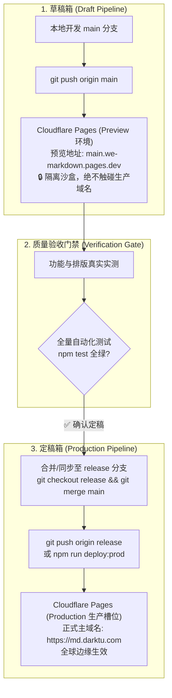

# 📘 WeMarkdown (暗图排版) — 部署与双轨分支运维手册 (DEPLOYMENT.md)

> 🛡️ **生产安全铁律**：严防 Cloudflare Pages 误将草稿半成品当作正式版本发布！  
> 本项目实行严格的 **双轨分支隔离模型**：  
> • **`main` 分支 = 草稿箱 (Draft / Preview)** ➔ 仅用于日常开发、自测与临时预览快照；  
> • **`release` 分支 = 定稿箱 (Production / Live)** ➔ 唯一绑定正式子域名 `md.darktu.com`。

---

## 🧭 双轨分支流与防呆机制 (Dual-Branch Pipeline)



---

## ⚙️ Cloudflare Pages 控制台防认错配置 (Console Settings)

在 Cloudflare Dashboard 中创建或管理 `we-markdown` 项目时，必须严格核对以下设置：

| 配置项 | 推荐值 | 说明 |
| :--- | :--- | :--- |
| **Project name** | `we-markdown` | Cloudflare Pages 项目代号 |
| **Framework preset** | `Vite` | 前端构建预设 |
| **Build command** | `pnpm --filter @we-markdown/web build` | 仅构建 Web 前端 |
| **Build output directory** | `apps/web/dist` | 构建输出产物目录 |
| 🚨 **Production branch** | **`release`** | **核心防呆点**：必须选 `release`！绝不能使用 `main`，防止草稿误触生产！ |
| **Custom domains** | **`md.darktu.com`** | 绑定到 Production 槽位，自动获得免费 SSL 证书 |

---

## 🛠️ 运维与部署命令速查 (Runbook)

```bash
# ==========================================
# 1. 日常草稿开发 (main 分支)
# ==========================================
git checkout main

# 本地启动热重载开发
npm run dev:web

# 运行全量机械架构与规则测试
npm test

# 推送至草稿箱 (自动触发 Preview 预览)
git push origin main

# 或通过 Wrangler 直传预览沙盒
npm run deploy:preview


# ==========================================
# 2. 正式定稿上线 (release 分支)
# ==========================================
# 步骤 A: 切换至定稿分支并同步 main 最新经测试的代码
git checkout release
git merge main --ff-only
git push origin release

# 步骤 B: 通过 Wrangler 部署至正式生产槽位 (立即更新 md.darktu.com)
npm run deploy:prod

# 步骤 C: 切回草稿箱继续日常工作
git checkout main
```

---

## 🔒 故障应急与版本回滚 (Instant Rollback)

若生产环境 `md.darktu.com` 出现紧急故障：
1. 打开 Cloudflare Pages 控制台 ➔ 进入 `we-markdown` 项目 ➔ **Deployments** 列表；
2. 找到上一个已知正常的 Production 部署条目；
3. 点击右侧选项 ➔ 选择 **Rollback to this deployment**，全球边缘网络 3 秒内完成毫秒级回滚。
