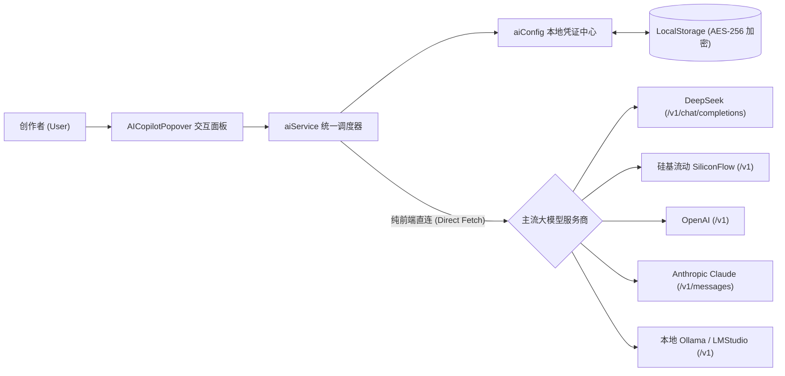
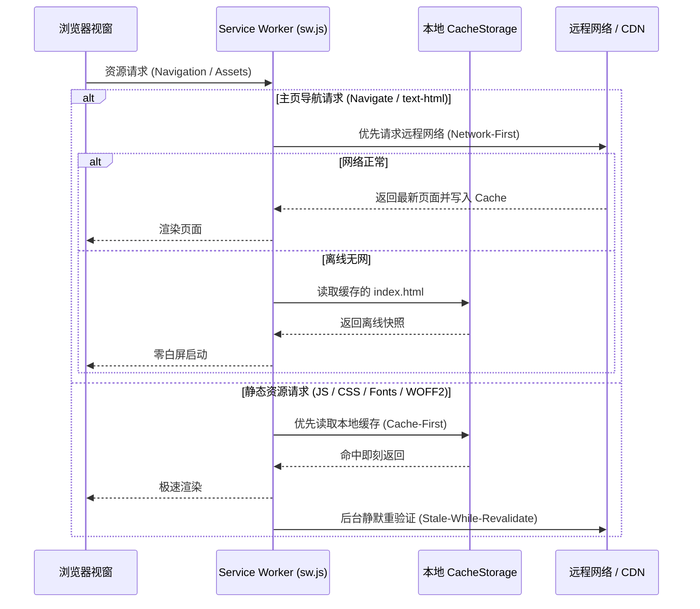

<!-- 🔒 本地私密技术架构档案 · 严禁公网上传 · 严禁发布泄露 -->

# 🟣 [Tier-2 · 深度技术规格] we-markdown 深度技术规格与架构设计 (tech_spec.md)

> 🛡️ **重要程度：Tier-2（深度架构规格 · 核心开发与审计基线）**  
> **关联图谱**：详细三维可观测契约参见 [`docs/feature_map.md`](file:///./feature_map.md)；全局宪法约束参见工作区根目录 [`GEMINI.md`](file:///../../GEMINI.md)。

---

## 📌 一、系统全景架构 (System Architecture)

```
┌─────────────────────────────────────────────────────────────────────────┐
│                       1. 表现与入口层 (Presentation/CLI)                 │
│                       • `src/index.js` (轻量装配控制器)                  │
└────────────────────────────────────┬────────────────────────────────────┘
                                     │
┌────────────────────────────────────▼────────────────────────────────────┐
│                       2. 核心业务服务层 (Domain Services)                │
│                       • `src/services/` (独立文件隔离扩展)               │
└────────────────────────────────────┬────────────────────────────────────┘
                                     │
┌────────────────────────────────────▼────────────────────────────────────┐
│                       3. 通用工具与驱动层 (Utils/Drivers)                │
│                       • `src/utils/` (纯函数工具库)                      │
└─────────────────────────────────────────────────────────────────────────┘
```

---

## 🤖 二、AI 创作副驾驶 (BYOK AI Copilot) 架构设计

### 1. 架构拓扑与隐私安全模型 (Zero-Leakage BYOK Topology)



- **零数据上云原则**：请求直接从用户本地浏览器发送至对应 LLM 端点，无任何中间服务器，绝对杜绝内容泄露；
- **AES-256 本地加密**：API Key 在写入 `LocalStorage` (`wemd-ai-config`) 前经 AES 混淆加密，避免 XSS 静态明文提取。

### 2. 结构化解析与容错降级状态机

````mermaid
flowchart TD
    Raw["LLM 原始响应字符流"] --> Check{"直接 JSON.parse() ?"}
    Check -- "成功" --> Valid["返回结构化结果 (Titles / Quotes)"]
    Check -- "失败" --> CodeBlock{"从 ```json 代码块提取 ?"}
    CodeBlock -- "成功" --> Valid
    CodeBlock -- "失败" --> Substring{"截取首个 [ / { 与末尾 ?"}
    Substring -- "成功" --> Valid
    Substring -- "失败" --> Fallback["行正则解析降级容错"]
````

---

## 📱 三、PWA 离线运行与移动端触控架构

### 1. Service Worker 离线拦截策略 (Cache-First + SWR)



### 2. 移动端触控滑屏数学判据 (Touch Swipe Vector Equation)

当触控结束时，计算位移向量 $\Delta \mathbf{P} = (\Delta x, \Delta y)$：

$$
\begin{cases}
|\Delta x| \ge 55\text{px} \\
|\Delta x| > 1.5 \times |\Delta y|
\end{cases}
$$

- 当满足上述条件且 $\Delta x < 0$ 时，触发状态迁移：$\text{activeView} \gets \text{'preview'}$；
- 当满足上述条件且 $\Delta x > 0$ 时，触发状态迁移：$\text{activeView} \gets \text{'editor'}$。
